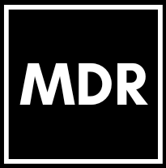

# MDR - Équipe d'eSports

Bienvenue sur la page GitHub de l'équipe MDR, une équipe d'eSports passionnée de CS2.

## À Propos

MDR va bien au-delà d'être une simple équipe d'eSports. Nous sommes une fraternité de joueurs passionnés unis par une quête commune : repousser les limites du possible dans l'univers de CS2. Chacun de nos membres apporte son propre style de jeu, sa stratégie unique et une détermination inébranlable sur le champ de bataille virtuel. Notre force réside dans notre capacité à anticiper les mouvements adverses, à coordonner nos attaques et à faire preuve d'une précision chirurgicale.

## Composition de l'Équipe

### Anchor
L'Anchor est notre fondation solide, la pierre angulaire sur laquelle repose notre défense. Sa maîtrise des positions clés et son calme en toutes circonstances en font un pilier inébranlable.

### Lurker
Le Lurker opère dans l'ombre, jouant le rôle du prédateur silencieux. Son expertise en infiltration et en jeu furtif lui permet de créer des opportunités à partir de situations apparemment désespérées.

### AWPer
L'AWPer est l'œil acéré de notre équipe, capable d'éliminer des adversaires à distance avec une précision mortelle. Sa capacité à tenir les angles et à ouvrir des brèches est inestimable.

### IGL (In-Game Leader)
L'IGL est notre stratege en chef. Il prend les décisions cruciales, coordonne les mouvements et inspire la confiance dans l'équipe. Sa vision stratégique donne le ton à notre jeu.

### Entry Fragger
L'Entry Fragger est la pointe de la lance, le premier à pénétrer dans la mêlée. Son agressivité calculée et sa capacité à ouvrir le jeu sont essentielles pour créer des opportunités.

## Recrutement

Nous cherchons à élargir notre famille MDR et à accueillir de nouveaux talents qui partagent notre passion pour CS2. Nous recherchons :

- Animateur : Quelqu'un qui sait animer, divertir et créer une ambiance positive au sein de notre communauté.
- Coach volontaire : Une personne expérimentée, désireuse de partager ses connaissances et d'aider nos membres à progresser.
- Graphiste : Un créatif qui peut apporter une touche visuelle à notre présence en ligne, des logos aux graphismes de médias sociaux.
- Modérateurs Discord : Des gardiens vigilants de notre communauté en ligne, veillant à ce que l'atmosphère soit conviviale et respectueuse.

Si vous êtes passionné, engagé et prêt à contribuer à notre équipe, alors vous pourriez être exactement la personne que nous cherchons !

## Contact

Pour toute demande de recrutement ou de collaboration, n'hésitez pas à nous contacter à l'adresse suivante : [contact@mdresports.com](mailto:contact@mdresports.com).
